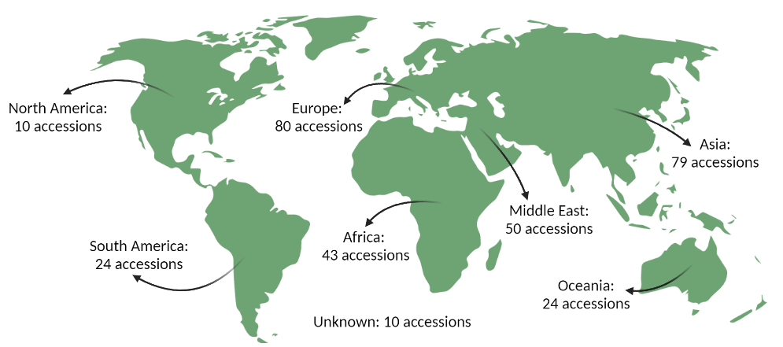
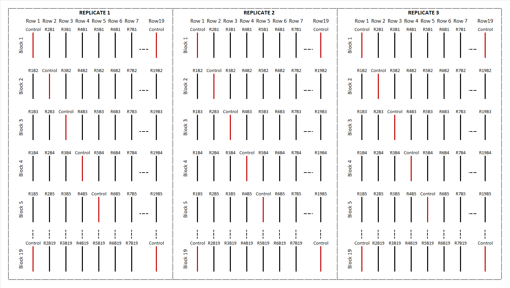

```{r setup, include=FALSE}
knitr::opts_chunk$set(echo = TRUE)
```

## Overview

### Introduction

For three months, the PhD candidate Salvador Osuna-Caballero will be in CREA Lodi to learn bioinformatics tools to apply in his own data set. The main goal is to apply **Genomic Selection** models over those data to obtain results with high precision and accuracy.

### Material

A pea collection of 320 genotypes that include:

| Material      | n accessions (%) |
|---------------|------------------|
| Landrace      | 175 (54.7 %)     |
| Cultivar      | 47 (14.7 %)      |
| Wild          | 45 (14.1%)       |
| Unknown       | 44 (13.8 %)      |
| Breeding Line | 9 (2.8 %)        |

Of the following *Pissum* spp. taxa diversity:

| Taxa                                          | n accessions (%) |
|:----------------------------------------------|------------------|
| *Pisum sativum* ssp. *sativum*                | 231 (72.8 %)     |
| *Pisum sativum* ssp. *arvense*                | 27 (8.8 %)       |
| *Pisum sativum* ssp. *elatius*                | 22 (7.2 %)       |
| *Pisum fulvum*                                | 17 (5.0 %)       |
| *Pisum abyssinicum*                           | 12 (3.8 %)       |
| *Pisum sativum* ssp. *elatius* var. *pumilio* | 4 (1.3 %)        |
| *Pisum sativum* ssp. *transcaucasicum*        | 2 (0.6 %)        |
| *Pisum sativum* ssp. *choresmicum*            | 1 (0.3 %)        |
| *Pisum sativum* ssp. *cinereum*               | 1 (0.3 %)        |

Constituting of following worldwide panel:

{width="630"}

### Experimental designs

#### Field

The pea collection was phenotyped over three crop seasons (2017/18, 2018/19 and 2019/20) at Cordoba, Spain using the pea cv. Cartouche as control check for all the traits measured. Each field assays consist of a randomized complete block design (RCBD) based on alpha lattice model was performed with three replicates. The experimental unit consisted of a single 1 m long row per accession with 10 seeds per row, separated from the adjacent row by 0,7 m.

{width="1000"}

##### Traits evaluated

-   [Germinated plants.]{.ul} For the ten seeds sown, how many of them germinated properly in the soil. (3 seasons)

-   [DtFF.]{.ul} Days to First Flower. Days from the sowing to the first flower appeared in the experimental unit. (2 seasons)

-   [GDDtFP.]{.ul} Growing Degree Days to First Flower. Accumulate temperature from the sowing to the first flower appeared in the experimental unit. (2 seasons)

-   [DtF.]{.ul} Days to Flowering. Days from the sowing to the 50 % flowering plants. (3 seasons)

-   [GDDtF.]{.ul} Growing Degree Days to Flowering. Accumulate temperature from the sowing to the 50% flowering plants. (3 seasons)

-   [DtFP.]{.ul} Days to First Pod. Days from the sowing to the first pod appeared in the experimental unit. (3 seasons)

-   [GDDtFP.]{.ul} Growing Degree Days to First Pod. Accumulate temperature from the sowing to the first pod appeared in the experimental unit. (3 seasons)

-   [DtP.]{.ul} Days to Podding. Days from the sowing to the 50 % podding plants. (3 seasons)

-   [GDDtP.]{.ul} Growing Degree Days to Podding. Accumulate temperature from the sowing to the 50% podding plants. (3 seasons)

-   [DtM.]{.ul} Days to Madurity. Days from the sowing to the 100 % pods are grain full. (2 seasons)

-   [GDDtM.]{.ul} Growing Degree Days to Podding. Accumulate temperature from the sowing to the100 % pods are grain full. (2 seasons)

-   [Biomass.]{.ul} Dry Biomass of the experimental unit in kg. Dry Biomass per plant is also included in an additional column in grams. (3 seasons)

-   [Yield.]{.ul} Total yield in kg of dry seeds. Yield per plant is also included in an additional column in grams. (3 seasons)

-   [ASCO.]{.ul} Ascochyta blights incidence over the experimental unit, calculated in percentage of canopy damage over the total plants. (2 seasons)

-   [POWDERY MILDEW.]{.ul} *Erysiphe pisi* incidence over the experimental unit, calculated in percentage of coverage by the fungus mycelium over the total plants. (2 seasons)

-   [RUST.]{.ul} *Uromyces pisi*, artificially inoculated to ensure the homogeneity of the disease, severity in the experimental unit. Calculated in coverage percentage by pustules over the plants. (3 seasons)

#### Growth Chamber (Controlled Conditions)

In this case the experimental unit consisted in a single plant evaluated per accession. In every rust inoculation, two replicates per accession were evaluated and two separated inoculations were carried out using the rust susceptible Messire cv. as control check.

##### Traits evaluated

-   IF. Infection frequency as number of pustules per cm^2^ of leaf, counted every day from day 7 after inoculation to day 14, when the life cycle of rust ended.

-   AUDPC. The IF measured every day allow to calculate the area under the disease progress curve.

-   LP~50~. The IF measured every day allow to calculate the latency period. It is the period time from the inoculation to the 50 % of total pustules appeared.

-   DS (%). The disease severity is a subjective estimation of the damage caused by rust. It is the percentage of pustules over the total plant.

-   IT. The infection type according to [@stackman1962identification]

## Tasks

### Task 1. Create a main folder

It is important to have the project well organized. So, the first step is create a folder with the following sub-folder:

-   Data

-   Scripts (.R files)

-   report (.Rmd, .html)

-   Results

-   Complementary folders (i.e. bibliography)

This main folder containing all the project information needs a backup. I am currently using MEGA cloud but try to use GitHub is desirable.

### Task 2. Solve the 𝛂 lattice (Get rid of repetitions)

To solve the alpha lattice design the accessions are previously normalized with his control. (Create a function to automatize that process, with Excel is quietly long).

```{r, include= F}
library(metan)
library(readxl)
library(tidyverse)
R18 <- read_excel("~/GitHub/Genomic-Selection/Genomic Selection_SALVA/data/Ensayocampo2018.xlsx", sheet = "RawData", col_types = 
                    c("text", #ENV
                      "numeric", #REP
                      "numeric", #BLOCK
                      "numeric", #ROW
                      "text", #GEN
                      "numeric", #GERM
                      "numeric", #BIOM
                      "numeric", #BIOM_PL
                      "numeric", #YIELD
                      "numeric", #YIELD_PL
                      "numeric", #BIOM/YIELD
                      "numeric", #Rust in %
                      "numeric", #Dtf
                      "numeric", #DtFP
                      "numeric", #DtP
                      "numeric", #Ascochyta in %
                      "numeric"  #Oidio in %
                      )) 
```

```{r}
#Load data frame:
head(R18)

```

```{r}
## Metan package allow to calculate BLUPs and others stability indexes and parameters. It also offer statistic help.
library(metan)
gen_alpha <- 
  gamem(R18, #data
        GEN, #genotype
        REP, #replicate
        c("T_Rust", "Asco", "Oidio"), # diseases trait
        block = BLOCK) #block
```

```{r}
#plot(gen_alpha, type = "re")
get_model_data(gen_alpha)

```

```{r, fig.height= 10, fig.width= 8}
##BLUP histogram for diseases in 2018 season:
par(mfrow = c(3,2))

hist(gen_alpha$T_Rust$BLUPgen$Predicted , main = "BLUP distribution of Rust %")
hist(R18$T_Rust,  main = "RawData distribution of Rust %")

hist(gen_alpha$Asco$BLUPgen$Predicted , main = "BLUP distribution of Ascochyta %")
hist(R18$Asco,  main = "RawData distribution of Ascochyta %")

hist(gen_alpha$Oidio$BLUPgen$Predicted , main = "BLUP distribution of Oidio %")
hist(R18$Oidio,  main = "RawData distribution of Oidio %")
```

### Task 3. Create useful functions to recycle the console

Let's try to create a function to add automatically a new column in our data frame. That columns will be the observation (every row in the data frame) of a trait properly normalized with their row/block (in the field design) controls and the average of the trait in the ENV (environment). First, it is necessary to create the Correction Factor function:

$\frac{\overline{X}_{ENV}}{(\overline{X}_B + \overline{X}_R)/2} = CF_{B,R}$

Here, $CF_{B,R}$ is the Correction Factor for every observed trait, ${\overline{X}_{ENV}}$ is the total average for the trait. ${\overline{X}_{B}}$ is the average of the controls observed in the same trait of the Block and ${\overline{X}_{R}}$ is the average of the controls observed in the same trait of the Row. Every observation multiplied by his $CF_{B,R}$, means the value normalized in the new column.

First, create the matrix of $CF_{B,R}$ for every rep:

```{r, include = F}
GERM_B1 <- R18 %>%
  group_by(BLOCK) %>%
  filter(REP == "1") %>%
  filter(GEN == "Control") %>%
  summarise(T_Germ = mean(T_Germ)) %>%
  arrange(BLOCK)

GERM_B2 <- R18 %>%
  group_by(BLOCK) %>%
  filter(REP == "2") %>%
  filter(GEN == "Control") %>%
  summarise(T_Germ = mean(T_Germ)) %>%
  arrange(BLOCK)

GERM_B3 <- R18 %>%
  group_by(BLOCK) %>%
  filter(REP == "3") %>%
  filter(GEN == "Control") %>%
  summarise(T_Germ = mean(T_Germ)) %>%
  arrange(BLOCK)

GERM_R1 <- R18 %>%
  group_by(ROW) %>%
  filter(REP == "1") %>%
  filter(GEN == "Control") %>%
  summarise(T_Germ = mean(T_Germ)) %>%
  arrange(ROW)

GERM_R2 <- R18 %>%
  group_by(ROW) %>%
  filter(REP == "2") %>%
  filter(GEN == "Control") %>%
  summarise(T_Germ = mean(T_Germ)) %>%
  arrange(ROW)

GERM_R3 <- R18 %>%
  group_by(ROW) %>%
  filter(REP == "3") %>%
  filter(GEN == "Control") %>%
  summarise(T_Germ = mean(T_Germ)) %>%
  arrange(ROW)
```

```{r}
# Create a 19 x 19 matrix (of 19 rows and 19 blocks)
  #vector for every rep:
RowsR1 <- c(GERM_R1$T_Germ)
BlocksR1 <- c(GERM_B1$T_Germ)

my_matR1 <- matrix(nrow=max(R18$ROW), ncol=max(R18$BLOCK))
for (i in 1:length(RowsR1)){
  for (j in 1:length(BlocksR1)){
    my_matR1[i,j]<-(mean(R18$T_Germ))/((RowsR1[i]+BlocksR1[j])/2)       
  }
}

format(round(my_matR1, 2), nsmall = 2) #show with two decimals

```
```{r, include=FALSE}
#The matrixes for Rep 2 and Rep 3

RowsR2 <- c(GERM_R2$T_Germ)
BlocksR2 <- c(GERM_B2$T_Germ)

RowsR3 <- c(GERM_R3$T_Germ)
BlocksR3 <- c(GERM_B3$T_Germ)

my_matR2 <- matrix(nrow=max(R18$ROW), ncol=max(R18$BLOCK))
for (i in 1:length(RowsR2)){
  for (j in 1:length(BlocksR2)){
    my_matR2[i,j]<-(mean(R18$T_Germ))/((RowsR2[i]+BlocksR2[j])/2)       
  }
}
format(round(my_matR2, 2), nsmall = 2) #show with two decimals

my_matR3 <- matrix(nrow=max(R18$ROW), ncol=max(R18$BLOCK))
for (i in 1:length(RowsR3)){
  for (j in 1:length(BlocksR3)){
    my_matR3[i,j]<-(mean(R18$T_Germ))/((RowsR3[i]+BlocksR3[j])/2)       
  }
}
format(round(my_matR3, 2), nsmall = 2) #show with two decimals
```

Now he have a matrix of 19 blocks x 19 columns equal to the experimental design for every replicate. To convert the matrix into a simple list to add in the original data frame:
```{r}
FCr1 <- unlist(as.data.frame(my_matR1))
```
```{r, include=FALSE}
FCr2 <- unlist(as.data.frame(my_matR2))
FCr3 <- unlist(as.list(my_matR3))

```
The next step is to bind the three reps in one new column with the Correction Factor of a determined trait and multiply the specific CF by their observation value.

```{r}

bind_cols(FCr1, FCr2)

R18_t <- R18 %>%
  mutate(GERM_t = (T_Germ * FC_GERM))
```


```{r}
CF_function <- function(df, x) {
  
 p <-  df %>%
  filter(GEN == "Control") %>%
  ggbetweenstats(
    x     = REP,
    y     = x,
    title = "Distribution of Germination across Replicates in the Controls"
  )
 return(p)
}
```

```{r}
#CF_function(df = R18, x = R18$T_Germ)
```

```{r}

##Create a function that give you the average of a trait (selected as a vector) and select the controls inside de df if you select it.

fn.media.dataframe <- function(df, argmivector, controls) {
  
  print("The mean of the vector selected in the DataFrame is")
  print(paste("Mean: ",round(mean(argmivector, ),2)))
  
  if (controls == T) {
    print(Control <- filter(df, GEN == "Control"))
  } else {
    print("No controls list shown")
  }
}
```

### Task 4. Start a report

Well... here we are...

## References
